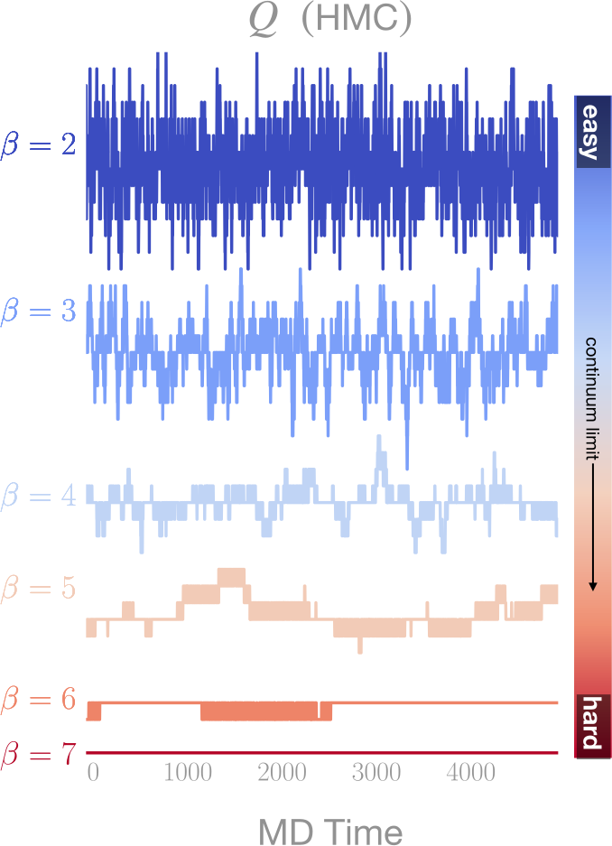

<link rel="stylesheet" href="https://fonts.googleapis.com/css?family=Sofia&effect=fire">
<link rel="stylesheet" href="https://fonts.googleapis.com/css?family=Roboto">

<!-- .slide: data-background="#1c1c1c" -->
<h2 class="r-fit-text">Training Topological Samplers</h2>

## for Lattice Gauge Theories

### 
[**Sam Foreman**](mailto://foremans@anl.gov)

##### 09/29/2021

---

# Generating Gauge Configurations

- In order to calculate physical quantities of interest, we 

---

## 
Critical Slowing Down

- As $\beta\rightarrow\infty$, configurations tend to get stuck at $Q=\text{const}$.

- Equivalently, the _**tunneling rate**_: $\delta Q\equiv\left|Q_{i+1} - Q_{i}\right|\rightarrow 0$ as $\beta\rightarrow\infty$

- 

  	<b>Goal</b>: Draw <i>independent</i> samples from target distribution $p(x)\propto e^{-\beta\,S(x)}$
  

---

## Hamiltonian Monte Carlo (HMC)

- Introduce $v \sim \mathcal{N}(0, \mathbb{I})$ distributed independently of $x$

- Our target density is then:
  $$ p(x, v) = p(x) \cdot p(v) = e^{-\beta S(x)}\cdot e^{-v^{T}v / 2} = e^{-H(x, v)}$$

- We can evolve the joint $\xi = (x, v)$ system using **Hamiltons equations** along $H=\text{const.}:$
  $$ \dot{x} = \frac{\partial H}{\partial v},\quad \dot{v} = -\frac{\partial H}{\partial x}$$

---

## Integrate Hamilton's equations

$$\dot{x}=\frac{\partial H}{\partial v},\quad \dot{v} = -\frac{\partial H}{\partial x}$$

Starting from $x_0$, we integrate along a _trajectory_ by 
1. Resample the momentum $v\sim\mathcal{N}(0,\mathbb{1})$
2. For $i = 1,

### <u>Leapfrog Step:</u>

$\xi\equiv (x, v)\rightarrow (x', v')$

<ol style="text-align: left; padding-right: 20px;">
<li> $\,\, \tilde{v}\leftarrow v - \frac{\varepsilon}{2}\cdot \partial_{x} S(x)$</li>

<li> $\,\, x'\leftarrow x + \varepsilon \tilde{v}$</li> 

<li> $\,\, v' \leftarrow \tilde{v} - \frac{\varepsilon}{2}\cdot \partial_{x} S(x')$</li>

### <u>Accept / Reject:</u>

$x_{i+1}\leftarrow\begin{cases}
x'\text{ w/ prob. } A(\xi'|\xi),\\
x_{i} \text{ w/ prob. }1 - A(\xi'|\xi)
\end{cases}$

and  `$A(\xi'|\xi)=\min\left\{1,\frac{p(\xi')}{p(\xi)}\left|\frac{\partial\xi'}{\partial\xi}\right|\right\}$`

---

**Metropolis-Hastings accept/reject**
  `\[\begin{equation}
  x_{i+1}\leftarrow
  \begin{cases}
  x'\quad\text{w/prob.}\quad A(\xi'|\xi)=\min\left\{1,\frac{p(\xi')}{p(\xi)}\left|\frac{\partial\xi'}{\partial\xi}\right|\right\},\\
      x_{i} \quad\text{w/prob.}\quad 1 - A(\xi'|\xi)
  \end{cases}
  \end{equation}\]`

---

  <!-- element.width:100% -->

---

## Hamiltonian Monte Carlo

<!-- 

<ol>
<li> $\,\, \tilde{v}\leftarrow v - \frac{\varepsilon}{2}\cdot \partial_{x} S(x)$</li>
<li> $\,\, x'\leftarrow x + \varepsilon \tilde{v}$</li>
<li> $\,\, v' \leftarrow \tilde{v} - \frac{\varepsilon}{2}\cdot \partial_{x} S(x')$</li>
</ol>

 -->

---

### Networks

---
	

	

		$p(\xi) = p(x)\cdot p(v)\cdot p(d)$
	

