<!-- .slide: data-background="#1c1c1c" -->
<!-- <h2 class="r-fit-text">Training Topological Samplers</h2> -->
## <h2 class="r-fit-text">Training Topological Samplers</h2>
## for Lattice Gauge Theories

### [**Sam Foreman**](https://www.samforeman.me)

<small>09/30/2021</small>

<small>Machine Learning for HEP, on and off the Lattice @ ECT* - Trento</small>

[`bit.ly/l2hmc-ect2021`](https://bit.ly/l2hmc-ect2021)

---

# Motivation

- Want to calculate observables
  $$ \langle \mathcal{O}\rangle\propto\int\left[\mathcal{D}x\right]\mathcal{O}(x)e^{-S(x)} $$
- If we had _independent configurations_, we could approximate the integral as
  $$ \langle\mathcal{O}\rangle\simeq\frac{1}{N}\sum_{n=1}^{N}\mathcal{O}(x_{n})\Rightarrow \sigma^{2}=\frac{1}{N}\text{Var}\left[\mathcal{O}(x)\right] $$

---

## Motivation

- For independent samples: 
  
  $$\langle \mathcal{O}\rangle \propto\int\left[\mathcal{D}x\right]\mathcal{O}(x)e^{-S(x)}
  \simeq\frac{1}{N}\sum_{n=1}^{N}\mathcal{O}(x_{n})\Rightarrow
  \sigma^{2}=\frac{1}{N}\text{Var}\left[\mathcal{O}(x\right)]$$
  
- Accounting for autocorrelations
  $$ \sigma^{2}=\frac{\color{#228BE6}{\tau_{\mathrm{int}}^{\mathcal{O}}}}{N}\text{Var}\left[\mathcal{O}(x)\right] $$
- $\tau_{\mathrm{int}}^{\mathcal{O}}$ is known to scale exponentially as we approach physical lattice spacing.

---

## Motivation

<!-- - The ability to efficiently sample from complicated sampling from complicated distributions is a widely studied  -->
- Generating independent configurations is currently a major bottleneck for
  lattice QCD.
- As the lattice spacing $a\rightarrow 0$ (or equivalently, $\beta \rightarrow \infty$),
  configurations get stuck in sectors of fixed gauge topology. 
  - Causes $\tau_{\mathrm{int}}$ to grow exponentially
  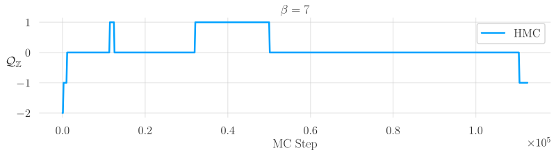

---

## 
Critical Slowing Down

- As $\beta\rightarrow\infty$, configurations tend to get stuck at $Q=\text{const}$.

- Equivalently, the _**tunneling rate**_: $\delta Q\equiv\left|Q_{i+1} - Q_{i}\right|\rightarrow 0$ as $\beta\rightarrow\infty$

- 

  	<b><u>Goal</u></b>: Draw <i>independent</i> samples from target distribution $p(x)\propto e^{-\beta\,S(x)}$
  

---

## Hamiltonian Monte Carlo (HMC)

- Introduce **momentum** $v \sim \mathcal{N}(0,
  \mathbb{1})$ distributed independently of $x$

- The joint target density is then:
  $ p(x, v) = p(x) \cdot p(v) = e^{-\beta S(x)}\cdot e^{-v^{T}v / 2} =
  e^{-H(x, v)}$

- We can evolve the joint $\xi = (x, v)$ system using **Hamiltons equations**
  

  

  $ \dot{x} = \frac{\partial H}{\partial v},\quad \dot{v} = -\frac{\partial
  H}{\partial x}$

  

  

  along $H=\text{const.}$ from $(x_{0}, v_{0})\rightarrow (x^{\ast}, v^{\ast})$

---

## Leapfrog Integrator

- 

Goal: Integrate Hamilton's eqs:
$(\dot x, \dot v) =
\left(\frac{\partial H}{\partial{v}}, \frac{\partial
H}{\partial{x}}\right)$

1. Starting from $x_{0}$, resample the momentum $v_{0}\sim\mathcal{N}(0,
\mathbb{1})$ and construct initial state: $\xi_{0} \equiv (x_{0}, v_{0})$

2. Integrate along a trajectory of $N_{\mathrm{LF}}$ leapfrog steps. For $i =
   1, 2,\ldots, N_{\mathrm{LF}}-1$:
   

   $($$x_{i}$$, v_{i})=\xi_{i}\rightarrow\xi':=\xi_{i+1}\rightarrow\cdots\rightarrow
   \xi_{N_{\mathrm{LF}}-1} \rightarrow \xi_{N_{\mathrm{LF}}} = \xi^{\ast}= \,($$x^{\ast}$$,
   v^{\ast})$
   

3. At the end of the trajectory, accept or reject the <i>proposal configuration</i>
   $\xi^{\ast}=\xi_{N_{\mathrm{LF}}} = (x^{\ast}, v^{\ast})$ with probability $A(\xi^{\ast}|\xi)$

<!-- 
 -->

#### <u><b>Leapfrog Step:</b></u> 
  <ol style="text-align: left;margin-top:-10px;">
  <li> $\,\,\,\tilde v\,\leftarrow v - \frac{\varepsilon}{2}\partial_{x} S(x)$</li>
  <li> $\,\, x'\longleftarrow x + \varepsilon\, \tilde v$</li>
  <li> $\,\,v' \leftarrow \tilde v - \frac{\varepsilon}{2}\partial_{x} S(x')$</li>

#### <u><b>Accept / Reject:</b></u>
  

  $x_{\mathrm{new}}\leftarrow\begin{cases}
  \color{#228BE6}{x^{\ast}}\text{ w/ prob. } A(\xi^{\ast}|\xi),\\
  \color{#F92672}{x_{i}} \text{ w/ prob. }1 - A(\xi^{\ast}|\xi),
  \end{cases}$
  
  $A(\xi^{\ast}|\xi)=\min\left\{1,\frac{p(\xi^{\ast})}{p(\xi)} \left|\frac{\partial\xi^{\ast}}{\partial\xi}\right|\right\}$
  

---

## HMC: Leapfrog Integrator

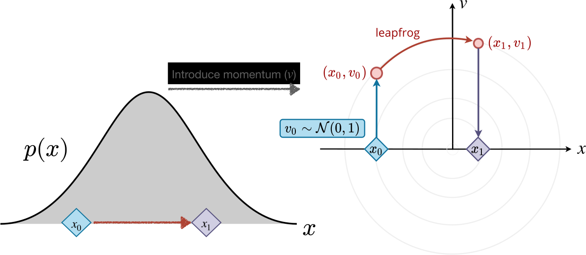

---

<section data-background-iframe="https://chi-feng.github.io/mcmc-demo/app.html"
          data-background-interactive>

---

## Issues with HMC

- Energy levels selected randomly $\rightarrow$ slow mixing!
- Cannot easily traverse low-density zones
- What do we want in a good sampler?
  - Fast mixing (small autocorrelations) 
  - Fast burn-in (quick convergence)
  - Ability to mix across energy levels and isolated modes

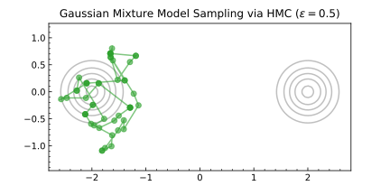
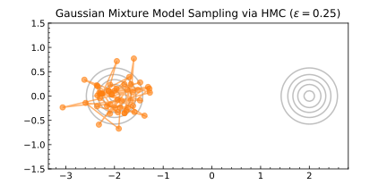

---

## Generalizing HMC

<!--
- 
  	<b><u>Goal</u></b>: Generate independent proposal configurations to efficiently sample the topological charge $Q$
  
-->

- **Main idea**:
  - Introduce six auxiliary functions $(s_x, t_x, q_x)$
    (collectively, $\Lambda^{\pm}$) and $(s_v, t_v,
    q_v)$ (collectively, $\Gamma^{\pm}$) into the leapfrog updates
  - Each of these functions are parameterized by weights $\theta$ in a neural network
    - Based on `RealNVP` [arXiv:1605.08803](https://arxiv.org/abs/1605.08803)
- **Require**:
  - reversibility: $p(a\rightarrow b) = p(b\rightarrow a)$
  - detailed balance: $p(x') K(x|x') = p(x) K(x'|x)$
  - ergodicity

---

## Generalizing the Leapfrog Update

<b><u>L2HMC Update</u></b>: `\(\xi_{k}\rightarrow\xi''_{k}\)`
<small>Note that we split the $x$ update into two complementary sub-updates in order to preserve reversibility.</small>

<!-- 
<b>Fig. (a)</b> Update steps for performing a single L2HMC update (left).
 -->

<b>Fig. (a)</b> Diagram illustrating the L2HMC leapfrog update</b>

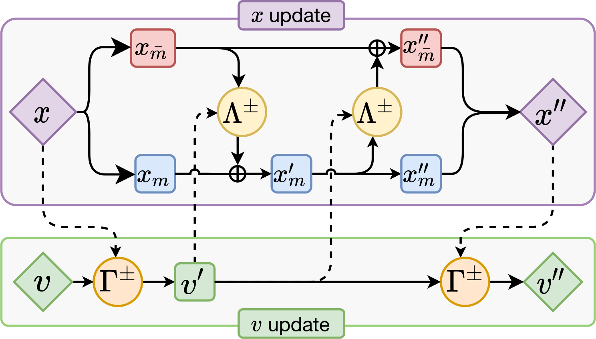
<small>Compare with the HMC update</small>

#### <u><b>HMC Update:</b></u> 
<ol style="text-align: left;margin-top:-10px;">
<li> $\,\,\,v'\,\leftarrow v - \frac{\varepsilon}{2}\partial_{x} S(x)$</li>
<li> $\,\, x'\longleftarrow x + \varepsilon\, v'$</li>
<li> $\,\,v'' \leftarrow v' - \frac{\varepsilon}{2}\partial_{x} S(x')$</li>
</ol>

---

## Generalizing HMC

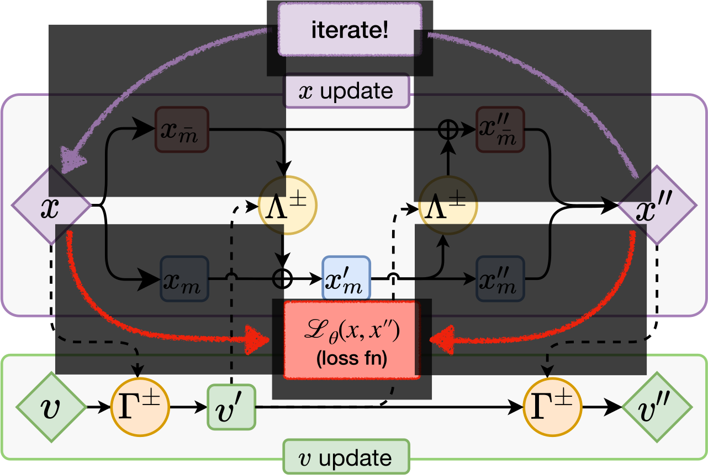

---

### Leapfrog Layer: Details

- Introduce persistent direction $d\sim\mathcal{U}(+, -)$ (_forward_ / _backward_)

- **Target Distribution**: $p(\xi) = p(x)\cdot p(v)\cdot p(d)$

- $k^{th}$-Leapfrog Layer: `\(\xi_{k} = (x_{k}, v_{k}, \pm)\rightarrow (x''_{k}, v''_{k}, \pm)\)`

$(\color{#F92672}{x_{k}}, v_{k})=\xi_{k}\rightarrow\xi':=\xi_{k+1}\rightarrow\cdots\rightarrow
\xi_{N_{\mathrm{LF}}-1} \rightarrow \xi_{N_{\mathrm{LF}}} = \xi^{\ast}= \,(\color{#228BE6}{x^{\ast}},
v^{\ast})$

- Construct a trajectory by passing $\xi_{k}$ through $k\in\{1, 2, \ldots,
  N_{\mathrm{LF}}\}$ leapfrog layers.
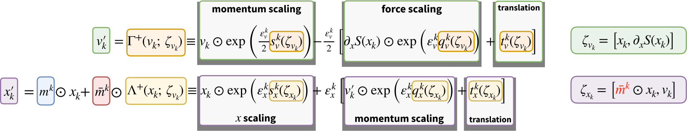

---

<!-- UPDATE WITH NETWORK AND FUNCTIONS -->

<b>Fig. (a)</b> Illustration of the generalized leapfrog update (top)

<!-- 
 -->

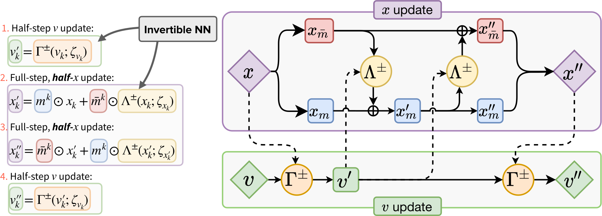

<b>Fig. (b)</b> Details of the functions $\Gamma^{\pm}$, $\Lambda^{\pm}$ for
updating $v$ and $x$ respectively (bottom);

---

<section id="gmm">

## Toy Example: GMM $\in \mathbb{R}^{2}$

- 
<b><u>Goal:</u></b> Train our sampler to
  effectively sample from both modes of the target distribution.

- Maximize _expected squared jump distance_
  

  \[\mathcal{L}_{\theta}(\xi', \xi) \equiv
  \color{#228BE6}{\mathbb{E}_{p(\xi)}\left[A(\xi'|\xi)\cdot \delta(\xi',
  \xi)\right]}\]
  

  where  $\delta(\xi, \xi') ={\lVert x - x'\rVert}^{2}$ is the squared jump
  distance between $x'$ and $x$.

---

## Toy Example: GMM $\in \mathbb{R}^{2}$

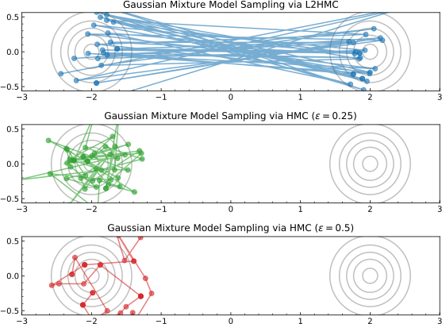

---

**Training Algorithm**

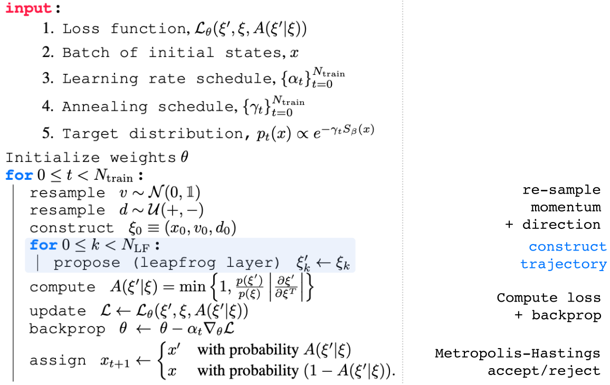

---
## Annealing Schedule

Introduce an _annealing schedule_ during the training phase:

`\[\left\{\gamma_{t}\right\}=\left\{\gamma_{0}, \gamma_{1}, \ldots,
\gamma_{N-1}, \gamma_{N}\right\},\text{ with}\]`
`\[\gamma_{0}<\gamma_{1}<\gamma_{2}<\cdots<\gamma_{N}\equiv 1, \text{ and}\]`
`\[|\gamma_{t+1}-\gamma_{t}|\ll 1 \]`

- For $\lVert\gamma_{t}\rVert<1$, this helps to rescale (shrink) the energy
  barriers between isolated modes

- Allows our sampler to explore previously inaccessible regions of the target distribution

- Target distribution becomes $p_{t}(x)\propto
  e^{-\gamma_{t}S(x)}$ for $t = 0, 1, \ldots, N$

---

### Lattice Gauge Theory

 

- **Link variables**: 
$U_{\mu}(x) = e^{i x_{\mu}(n)}\in U(1)$
with $x_{\mu}(n)\in[-\pi,\pi]$

- **Wilson Action**:
$S_{\beta}(x) = \beta\sum_{P} 1 - \cos x_{P}$
with $x_{P}= x_{\mu}(n) + x_{\nu}(n+\hat{\mu})-x_{\mu}(n+\hat{\nu})-x_{\nu}(n)$

- <b>Topological Charge</b>:
  - $Q_{\mathbb{R}} =
  \frac{1}{2\pi}\sum_{P} \sin x_{P}\in\mathbb{R}$ ✅
  (continuous, differentiable)

  - $Q_{\mathbb{Z}} =
  \frac{1}{2\pi}\sum_{P} \left\lfloor
  x_{P}\right\rfloor\in\mathbb{Z}$ ❌
  (discrete, hard to work with)

  here $\left\lfloor x_{P}\right\rfloor =
  x_{P}-2\pi\left\lfloor\frac{x_{P}+\pi}{2\pi}\right\rfloor$

---

# Loss Function

- Maximize the _expected squared charge difference_ :
  

  \[\begin{equation}
  \mathcal{L}(\theta) = \color{#228BE6}{\mathbb{E}_{p(\xi)}}
  \left[-\color{#FA5252}{{\delta Q}}^{2}_{\color{#FA5252}{\mathbb{R}}}(\xi', \xi)\cdot
  A(\xi'|\xi)\right]
  \end{equation}\]
  

- Where $\color{#FA5252}{\delta Q_{\mathbb{R}}}$ is the tunneling rate
  $$\delta Q_{\mathbb{R}}^{2}(\xi',\xi)=\left(Q_{\mathbb{R}}(x') - Q_{\mathbb{R}}(x)\right)^{2}$$
- And $A(\xi'|\xi)$ is probability of accepting the proposal configuration $\xi'$.
  $$ A(\xi'|\xi) = \min\left(1, \frac{p(\xi')}{p(\xi)}\left|\frac{\partial \xi'}{\partial \xi^{T}}\right|\right\)$$

---

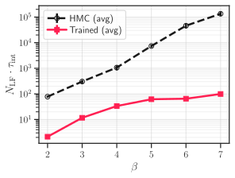
<b> Fig (a.)</b>  Comparison of $\tau_{\mathrm{int}}^{Q_{\mathbb{Z}}}$

<b> Fig (b.)</b> Topological charge history $Q_{\mathbb{Z}}$ vs MD time units.
for both the trained model (red) and HMC (black)

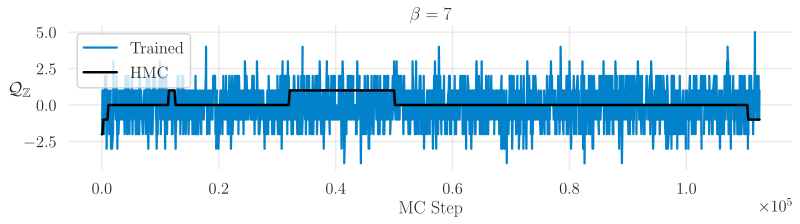

---

## $\tau_{\mathrm{int}}^{Q_{\mathbb{Z}}}$ at $\beta = 4$
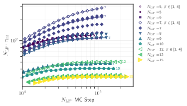

---

## Effective Action: $S_{\mathrm{eff}}(x)$
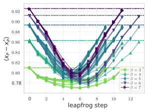

---

# Interpretation
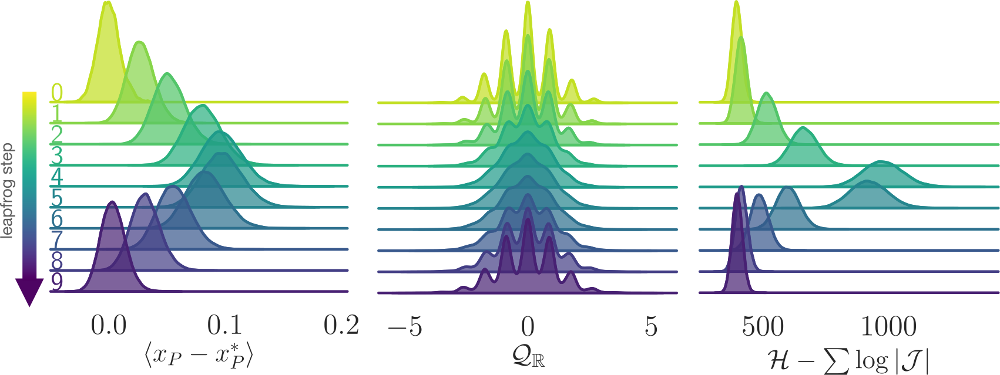
<small>
<b>(a.)</b> Deviation in the average plaquette (left);
<b>(b.)</b> Real-valued topological charge (middle);
<b>(c.)</b> Effective energy (right);

<b>Fig.</b> Illustration of how different observables evolve over a
single L2HMC trajectory.
</small>

---

## Interpretation

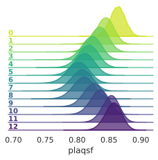
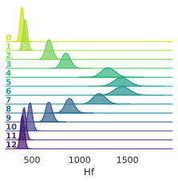
<small><b>Fig.</b> Illustration of how the trained model artificially
increases the energy towards the middle of the trajectory, allowing the sampler
to tunnel between isolated sectors.
<!-- 
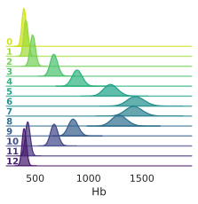 -->

---

# Interpretation

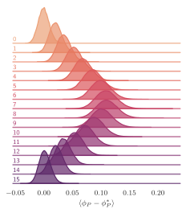
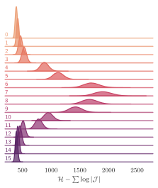

---

##  [l2hmc-qcd](https://github.com/saforem2/l2hmc-qcd)

- Source code publicly available

- Both `pytorch` and `tensorflow` implementations with support for distributed training, automatic checkpointing, etc.

- Generic interface, easily extensible

- <b>Work in progress</b> scaling up to 2D, 4D $SU(3)$

---

## Non-Compact Projection 
<small>[arXiv:2002.02428](https://arxiv.org/abs/2002.02428)</small>

- Project $x \in[-\pi, \pi]$ onto $\mathbb{R}$ using a transformation $z = g(x)$:
  $$ z = \tan\left(\frac{x}{2}\right) $$
- Perform the update in $\mathbb{R}$:
  $$ z' = m^{t}\odot z + \bar{m}^{t}\odot \left[\alpha z + \beta\right]$$
- Project back to $[-\pi, \pi]$ using $x = g^{-1}(z)$:
  $$ x = 2 \tan^{-1}(z) $$

---

# Non-Compact Projection

- Combine into a single update:
  $$ x' = \color{#228BE6}{m^{t}}\odot x +
  \color{#FA5252}{\bar{m}^{t}}\odot\left[2\tan^{-1}\left(\alpha\tan\left(\frac{x}{2}\right)\right)+\beta\right]
  $$
- With corresponding Jacobian:
  $$ \frac{\partial x'}{\partial x} = \frac{\exp(\varepsilon s_{x})}{\cos^{2}(x/2)+exp(2\varepsilon s_{x})\sin(x/2)} $$

---

## Acknowledgements

### Collaborators:
 - Xiao-Yong Jin
 - James C. Osborn

### References:
 - [Link to slides](https://bit.ly/l2hmc-ect2021)
 - [Link to github](https://github.com/saforem2/l2hmc-qcd)
 - [reach out!](mailto://foremans@anl.gov)
 - [Link to HMC demo](https://chi-feng.github.io/mcmc-demo/app.html)
 - [arXiv:2105.03418](https://arxiv.org/abs/2002.02428)
 - [arXiv:2002.02428](https://arxiv.org/abs/2002.02428)

### Huge thank you to:
 - Yannick Meurice
 - Norman Christ
 - Akio Tomiya
 - Luchang Jin
 - Chulwoo Jung
 - Peter Boyle
 - Taku Izubuchi
 - Critical Slowing Down group (ECP)
 - ALCF Staff + Datascience Group

<small> 
This research used resources of the Argonne Leadership Computing Facility,
which is a DOE Office of Science User Facility supported under Contract
DE-AC02-06CH11357.
</small>

---

### Network Architectures

---

### Network Architectures

---

